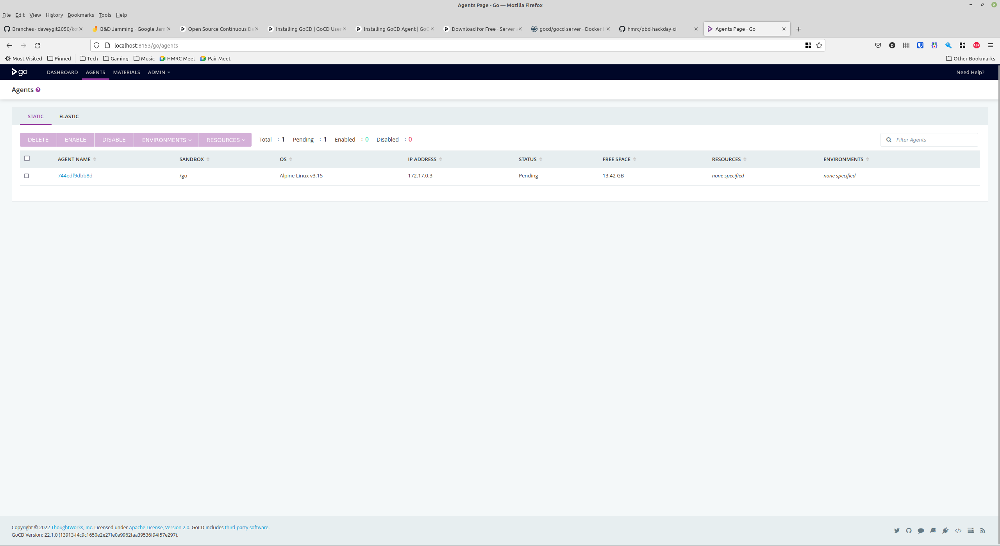

# GoCD

## Installation

### Launch the server

```docker run -d -p 8153:8153 gocd/gocd-server:v22.1.0```

Which is then available on http://localhost:8153 without any authentication. It provides a splash screen with some fluff on it while the server is starting up.

### Launching agents

GoCD provides downloads for Alpine, CentOS, Debian and Ubuntu agents of various versions, plus one called "docker-dind" which I presume is Docker in Docker.

To start at agent container, run it with the URL of the server container:

```docker run -d -e GO_SERVER_URL=http://172.17.0.2:8153/go gocd/gocd-agent-alpine-3.15:v22.1.0```

If successful, this should then show up in the "AGENTS" tab:



### Initial configuration

There are some post-setup stuff you can optionally do like:

* [Setting up a database, it supports H2, PostgreSQL and MySQL](https://docs.gocd.org/current/installation/configuring_database.html)
* [Configure a seperate partition for "for GoCD server artifacts"](https://docs.gocd.org/current/installation/configuring_server_details.html#artifact-repository-configuration)
* [Configure site URLs for reverse proxies](https://docs.gocd.org/current/installation/configuring_server_details.html#configure-site-urls)
* [Server-to-agent TLS](https://docs.gocd.org/current/installation/ssl_tls/end_to_end_transport_security.html)

## Links

* [Homepage](https://www.gocd.org/)
* [Installing](https://docs.gocd.org/current/installation/)
* [Docker downloads](https://www.gocd.org/download/#docker)
