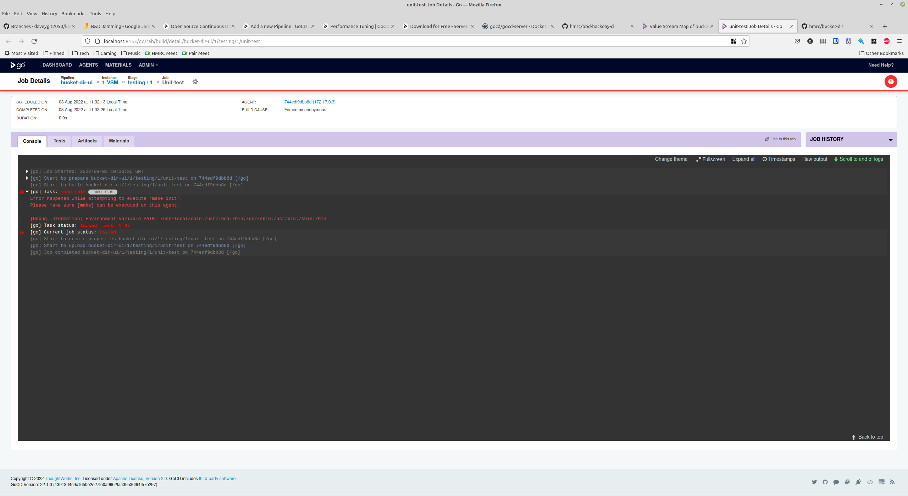
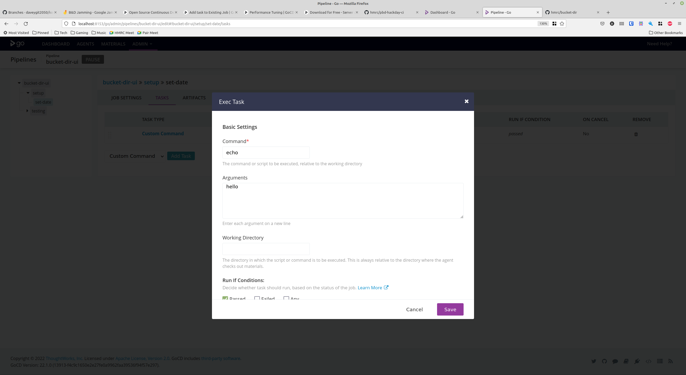

# GoCD

## Installation

### Launch the server

```docker run -d -p 8153:8153 gocd/gocd-server:v22.1.0```

Which is then available on http://localhost:8153 without any authentication. It provides a splash screen with some fluff on it while the server is starting up.

### Launching agents

GoCD provides downloads for Alpine, CentOS, Debian and Ubuntu agents of various versions, plus one called "docker-dind" which I presume is Docker in Docker.

To start at agent container, run it with the URL of the server container:

Alpine:

```docker run -d -e GO_SERVER_URL=http://172.17.0.2:8153/go gocd/gocd-agent-alpine-3.15:v22.1.0```

Debian:

```docker run -d -e GO_SERVER_URL=http://172.17.0.2:8153/go gocd/gocd-agent-debian-11:v22.1.0```

If successful, this should then show up in the "AGENTS" tab:


You then have to enable the agent for it to be allowed to receive builds.

### Initial configuration

There are some post-setup stuff you can optionally do like:

* [Setting up a database, it supports H2, PostgreSQL and MySQL](https://docs.gocd.org/current/installation/configuring_database.html)
* [Configure a seperate partition for "for GoCD server artifacts"](https://docs.gocd.org/current/installation/configuring_server_details.html#artifact-repository-configuration)
* [Configure site URLs for reverse proxies](https://docs.gocd.org/current/installation/configuring_server_details.html#configure-site-urls)
* [Server-to-agent TLS](https://docs.gocd.org/current/installation/ssl_tls/end_to_end_transport_security.html)

## Usage

### Pipeline setup

_[Docs](https://docs.gocd.org/current/configuration/quick_pipeline_setup.html)_

Pipelines can be configured via the UI, as code (YAML, JSON, Groovy (!) etc.), via an API or by cloning.

`Material` is the thing that triggers your pipeline, e.g. a repo in GitHub. I can't see a way of having a job that has no material (e.g. just run this thing please.)

#### Via UI

Trying to select [bucket-dir](https://github.com/hmrc/bucket-dir) gave me an error that `The ref refs/heads/master could not be found.`, but chaging the branch name fixed that.

There are a few configuration options such as shallow cloning, polling vs webhook/manual trigger etc.

After defining the material, you then configure the job via a combination of "stages", "jobs" and "tasks".

Whatever the default alpine agent does contain, `make` doesn't seem to be on that list:



Had more luck with a simple echo, but keep in mind you have to be pretty careful with specifying the command and the arguments properly. I'm not sure how well this would lend itself to doing adhoc bash, which is something we currently do quite heavily:



Bit of a silly thing, but I can't see an easy way of stepping for the configuration of the pipeline to being able to see or trigger the pipeline.

## Links

* [Homepage](https://www.gocd.org/)
* [Installing](https://docs.gocd.org/current/installation/)
* [Docker downloads](https://www.gocd.org/download/#docker)
