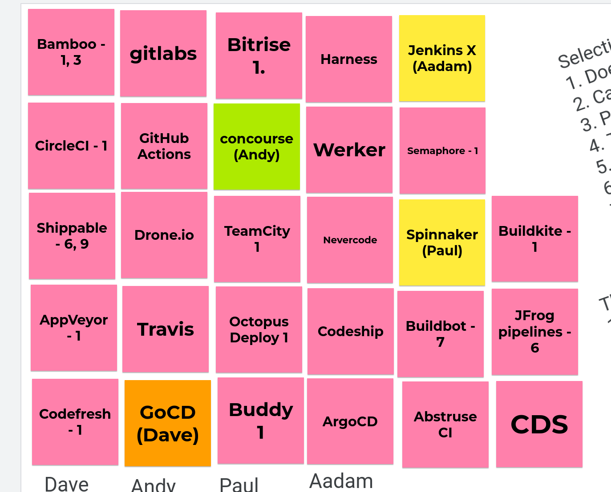

# pbd-hackday-ci

This repository contains the output of a hackday investigation into a potential replacement for Jenkins for building software on the HMRC Digital MDTP platform, by members of the HMRC Digital MDTP Build & Deploy team.

We looked at four open source tools:

* [Concourse](./concourse/)
* [Jenkins X](./jenkins-x/)
* [GoCD](./GoCD/)
* [Spinnaker](./spinnaker/)
### License

This code is open source software licensed under the [Apache 2.0 License]("http://www.apache.org/licenses/LICENSE-2.0.html").
