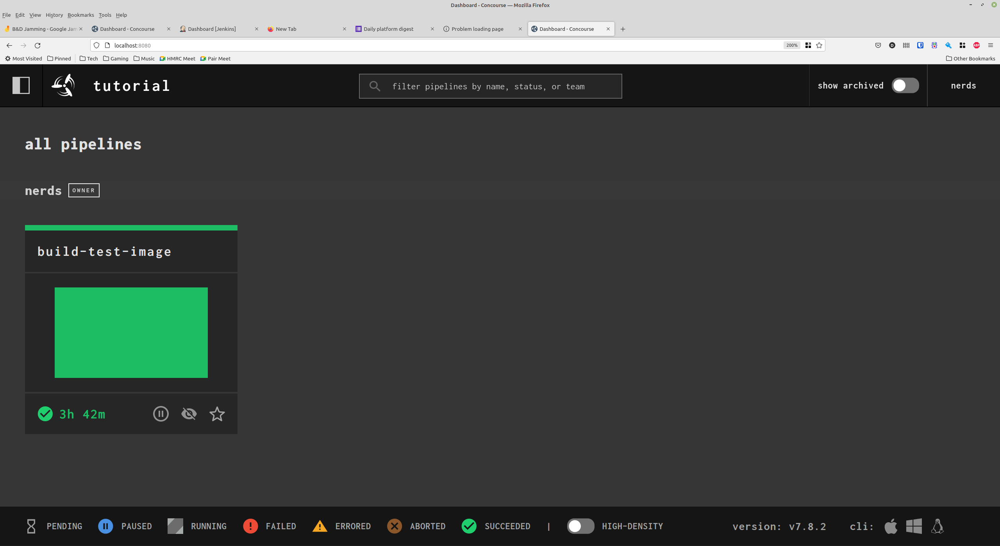

## Concourse CI

### URLs:
[Home page](https://concourse-ci.org)
[Tutorial](https://concourse-ci.org/getting-started.html)

### Install Process and first pipeline
[Quick Start](https://concourse-ci.org/quick-start.html)

* Make sure Docker is up to date and you have the docker-compose plugin installed

* Get the docker-compose file and run it:
```bash
curl -O https://concourse-ci.org/docker-compose.yml
docker-compose up -d
```

You should now be able to access Concourse on: http://localhost:8080

* Get and install fly-cli:

```bash
curl 'http://localhost:8080/api/v1/cli?arch=amd64&platform=linux' -o fly && chmod +x ./fly && sudo mv ./fly /usr/local/bin/
```

* Log fly-cli into the concourse instance running locally:

```bash
fly -t tutorial login -c http://localhost:8080 -u test -p test
logging in to team 'main'
```

* Use hello-world.yml and run the following:

```bash
fly -t tutorial set-pipeline -p hello-world -c hello-world.yml
fly -t tutorial unpause-pipeline -p hello-world
fly -t tutorial trigger-job --job hello-world/hello-world-job --watch
```

You can see the pipeline here:

http://localhost:8080/teams/main/pipelines/hello-world/jobs/hello-world-job


### Running 'make init' on bucket-dir

Have a look at the bucket-dir.yml file.
Needed to add the bucket-dir repo as a resource.
Resources are added as directories to the container and can be passed between jobs

### Teams

Concourse has a concept of "teams". Users can be made members of one or more teams, and they can see jobs that have been created against those teams.

To create a team with a certain user membership:

```fly -t tutorial set-team -n nerds --local-user nerds```

Then, to create jobs against a particular team, you first have to include the `--team-name` when logging in with `fly`:

```fly -t tutorial login -c http://localhost:8080 -u test -p test --team-name nerds```

And you then create jobs as normal, which will assign them to the active team:

```fly -t tutorial set-pipeline -p build-test-image -c build-test-image.yml```

This can be tested by logging in as the `nerds` user, which only allows you to see jobs for the `nerds` team, note that the jobs created against the `main` team are not visible to this user:



### Notes

* Jenkins pipeline = concourse job (Apparently, not too sure though!)
* Pipeline is made up of an unordered list of jobs
* Job comprised of ordered steps.
    * Each step runs in it’s own container on a worker node.
    * Nodes can be linux, darwin or windows.
    * Containers only linux.
* You can control access to pipelines via putting them in seperate [teams](https://concourse-ci.org/auth.html). This could be used to filter pipelines so that users only see what they need to see.


### To-do

* Look into what a migration would look like
* How to import all the jobs
* Any other things that could kill it dead
* Building docker images.
* Understand the implementation a little better
